<div align="center">

# 📊 EquityLens AI

### *Institutional-Grade Multi-Agent Equity Research Platform for Indian Small & Mid Cap Companies*

**EquityLens AI** automates institutional-grade equity research using multiple AI agents that collect, verify, debate, and synthesize financial information into evidence-backed reports with confidence scores and source citations.

### 🚀 Live Frontend Demo - https://nightingale-mirror.vercel.app
### ⚡ Live Backend API - https://nightingale-mirror-backend.onrender.com
### 📺 Youtbue Video - https://www.youtube.com/watch?v=Yt4_0WRjuKI


[](https://fastapi.tiangolo.com)
[](https://react.dev)
[](https://vitejs.dev)
[](https://postgresql.org)
[](https://ai.google.dev)
[](https://groq.com)
[](https://opensource.org/licenses/MIT)

</div>

---

## ✨ Key Features

- 🤖 **Multi-Agent AI Research** — Employs a specialized team of AI agents (Ingestion, Fundamental, Sentiment, Alternative Data) orchestrated by a Coordinator to autonomously conduct exhaustive research.
- 🔎 **Semantic Search** — Powerful natural language query engine to instantly find relevant financial data, filings, and qualitative metrics.
- 🏢 **Company Discovery** — Seamlessly filter and discover Indian Small & Mid Cap equities based on dynamic screening criteria.
- 📑 **AI Reports** — Generates complete, beautifully formatted, and objective equity research reports, simulating a top-tier financial analyst.
- 💬 **Research Copilot (QA Agent)** — Interactive chatbot contextually aware of the currently analyzed company, capable of answering specific financial queries.
- 🧠 **Agent Reasoning** — Full transparency into the multi-agent debate process; watch as agents propose arguments, verify claims, and reach a consensus.
- ⭐ **Watchlists** — Curate and track personalized lists of compelling equities to monitor their long-term performance and narrative shifts.
- ⚖️ **Comparative Analysis** — Evaluate multiple companies side-by-side using the dedicated Comparator agent to discover relative valuation and strategic advantages.
- 🎯 **Confidence Scoring** — Every insight and generated report is accompanied by an AI-calculated confidence score, providing a clear gauge of data reliability.
- 🔗 **Source Citation** — Claims are traced back to their origins (earnings transcripts, market news, specific filings), ensuring traceability and trust.

---

## 🖼️ Screenshots

**Landing Page — Gateway to EquityLens AI**
<div align="center">
  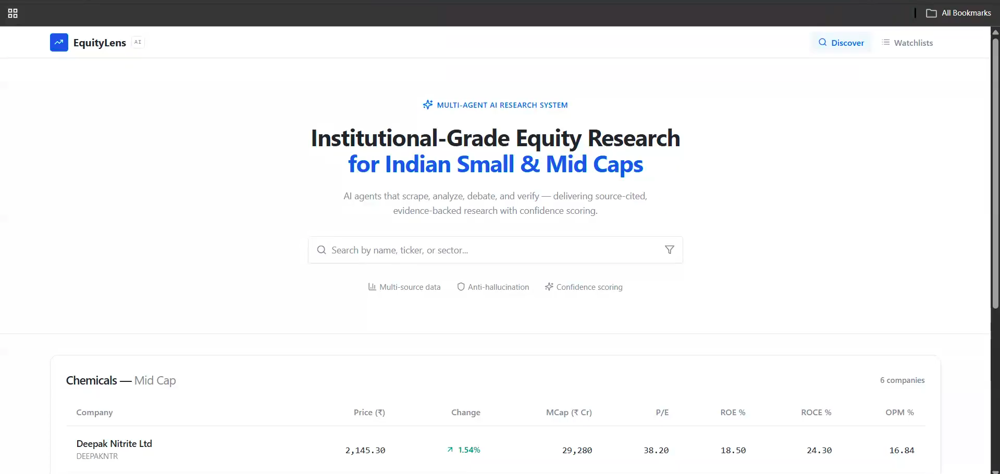
</div>

---

**Market Discovery — Find the Next Multi-Bagger**
<div align="center">
  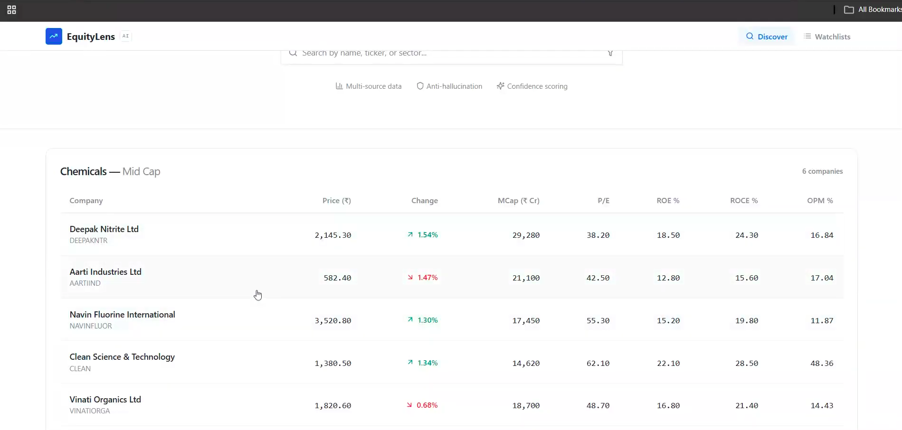
</div>

---

**Smart Search — Semantic Querying**
<div align="center">
  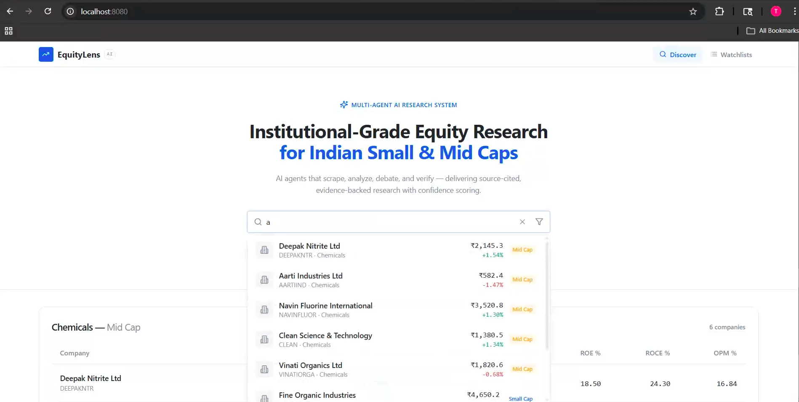
</div>

---

**Company Overview — The Dashboard**
<div align="center">
  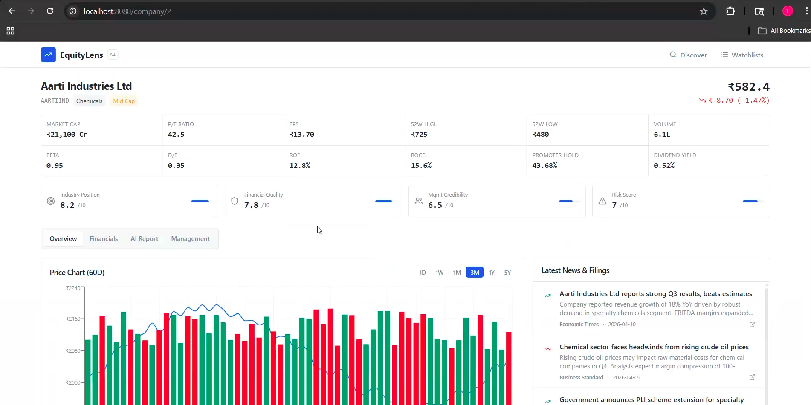
</div>

---

**Price Chart & News — Contextual Market Data**
<div align="center">
  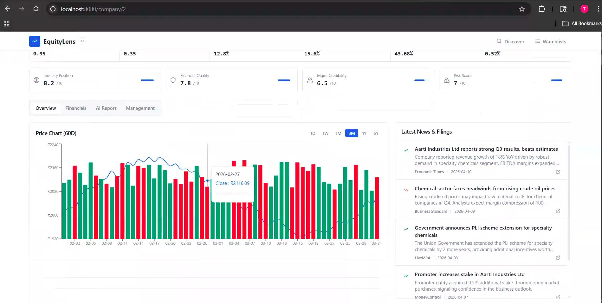
</div>

---

**Financial Statements — Standardized Fundamentals**
<div align="center">
  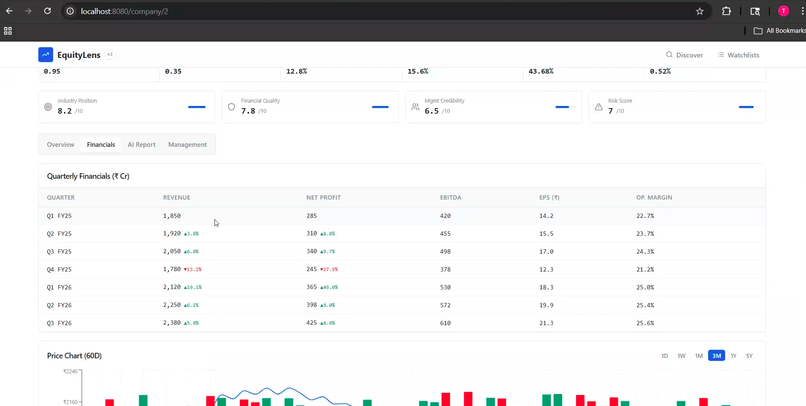
</div>

---

**AI Research Report — Analyst-Grade Synthesis**
<div align="center">
  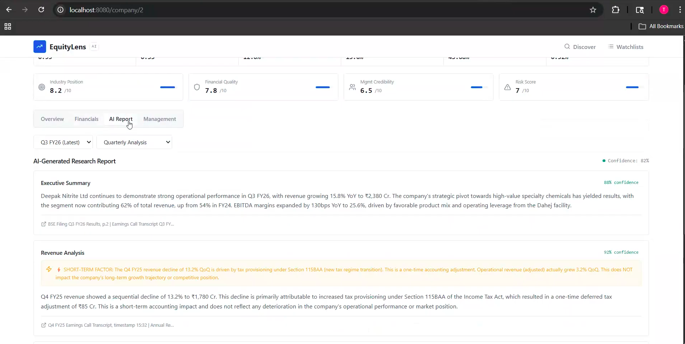
</div>

---

**Research Copilot — Your Personal Analyst**
<div align="center">
  
</div>

---

**Agent Reasoning — Transparency in Action**
<div align="center">
  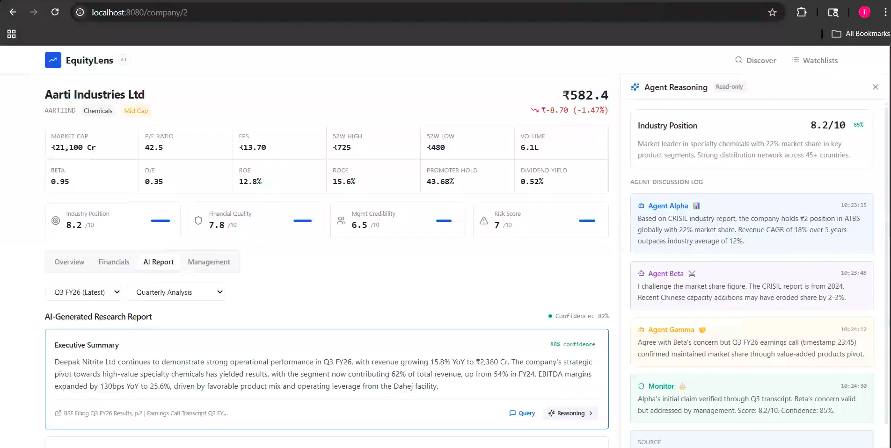
</div>

---

**Watchlists — Track Your Portfolio**
<div align="center">
  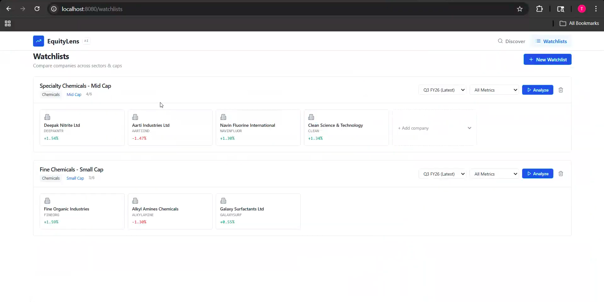
</div>

---

**Live Multi-Agent Analysis — Watching the Debate**
<div align="center">
  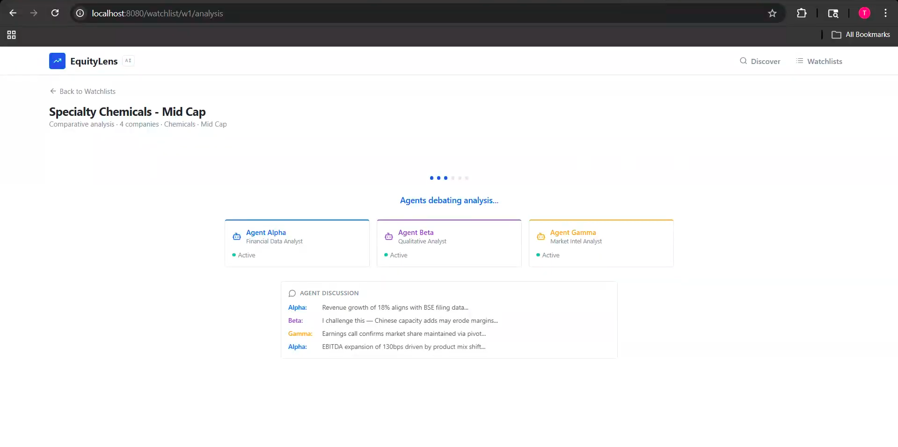
</div>

---

**Comparative Research Report — Relative Valuation**
<div align="center">
  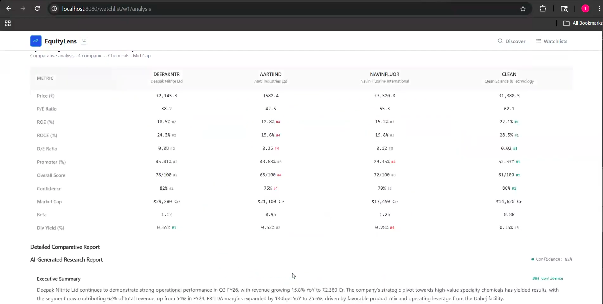
</div>

---

## 🏗️ System Architecture

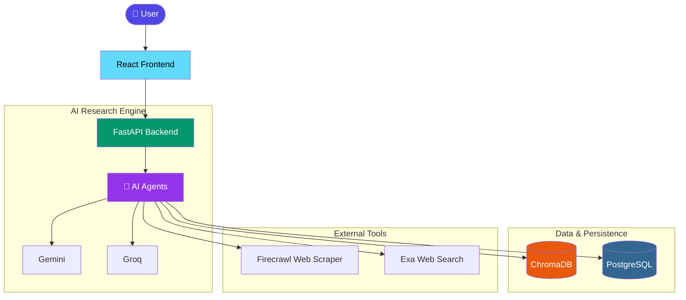

---

## 🧠 Multi-Agent Architecture

The core of EquityLens AI is its collaborative multi-agent framework. Agents are designed to handle specific domains of research, debate conflicting viewpoints, and synthesize a cohesive final report.

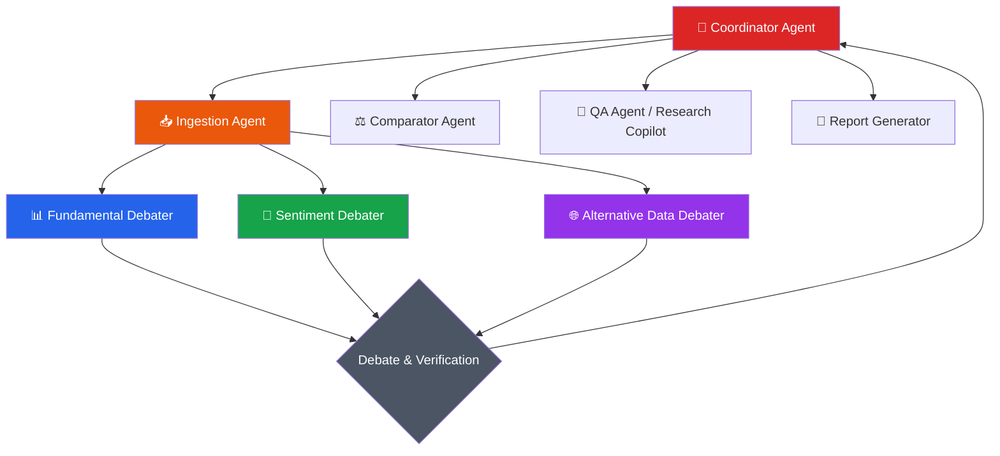

---

## 🔍 RAG Pipeline

EquityLens AI implements an advanced Retrieval-Augmented Generation (RAG) pipeline to ensure all generated insights are anchored in verified, ingested financial data.

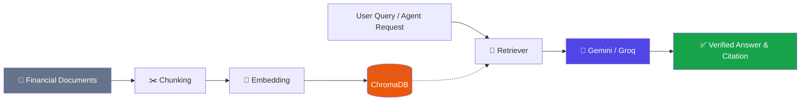

---

## 💻 Tech Stack

### Frontend

| Technology | Purpose |
|---|---|
| **React** | Component-based UI library |
| **Vite** | Blazing fast build tool and dev server |
| **TypeScript** | Type-safe JavaScript |
| **Tailwind CSS** | Utility-first CSS styling framework |
| **shadcn/ui** | Accessible and customizable UI components |

### Backend

| Technology | Purpose |
|---|---|
| **FastAPI** | High-performance Python web framework |
| **Python 3.10+** | Core backend language |

### AI & Data

| Technology | Purpose |
|---|---|
| **Gemini** | Primary LLM for generative reasoning and QA |
| **Groq** | Ultra-fast inference for specific agent tasks |
| **ChromaDB** | Vector database for RAG semantic search |
| **PostgreSQL** | Relational database for structured financial data |
| **Exa** | Intelligent web search API |
| **Firecrawl** | Specialized web scraping for financial reports |
| **PyPDF** | Parsing and extracting data from PDF filings |

### Deployment

| Component | Platform |
|---|---|
| **Frontend** | Vercel |
| **Backend** | Render |

---

## 🗂️ Folder Structure

```text
Nightingale-Mirror/
├── backend/
│   ├── agents/                   # Multi-agent logic (Coordinator, Debaters, Copilot)
│   ├── data/                     # Data processing utilities
│   ├── rag/                      # Retrieval-Augmented Generation modules
│   ├── storage/                  # Database models and interaction layers
│   ├── tools/                    # Search, scraper, and external API wrappers
│   ├── config.py                 # Environment configuration
│   ├── main.py                   # FastAPI application entrypoint
│   └── requirements.txt          # Python backend dependencies
│
├── frontend/
│   └── insight-navigator/        # React/Vite Frontend Application
│       ├── src/                  # React components, pages, and contexts
│       ├── package.json          # Node.js dependencies
│       └── tailwind.config.js    # Tailwind CSS configuration
│
├── screenshots/                  # UI showcase images
└── README.md                     # This file
```

---

## ⚙️ Installation & Setup

### 1. Clone the Repository

```bash
git clone https://github.com/tejesh/Nightingale-Mirror.git
cd Nightingale-Mirror
```

### 2. Backend Setup

```bash
cd backend

# Create and activate a virtual environment (recommended)
python -m venv .venv
source .venv/bin/activate  # On Windows: .venv\Scripts\activate

# Install dependencies
pip install -r requirements.txt
```

### 3. Frontend Setup

```bash
# From the root directory, navigate to the frontend folder
cd frontend/insight-navigator

# Install dependencies
npm install  # or yarn install / pnpm install
```

### 4. Run the Application Locally

**Start the Backend (FastAPI):**
```bash
# In the backend/ directory
uvicorn main:app --reload --port 8000
```

**Start the Frontend (Vite):**
```bash
# In the frontend/insight-navigator/ directory
npm run dev
```

The frontend will be available at `http://localhost:5173` (or port 3000 depending on Vite config), and the backend API at `http://localhost:8000`.

---

## 🔐 Environment Variables

Create `.env` files in the respective directories before running the application.

### Backend (`backend/.env`)

| Variable | Description |
|---|---|
| `GEMINI_API_KEY` | Google Gemini API key for the core LLM |
| `GROK_API_KEY` | Groq API key for fast inference models |
| `EXA_API_KEY` | Exa API key for intelligent web search |
| `LLAMA_CLOUD_API_KEY` | Llama Cloud API key for advanced parsing |
| `FIRECRAWL_API_KEY` | Firecrawl API key for scraping web data |
| `POSTGRES_URL` | Connection string for PostgreSQL database |
| `CHROMA_PERSIST_DIR` | Local directory to persist ChromaDB vectors |
| `ALLOWED_ORIGINS` | CORS origins (e.g., `http://localhost:5173,http://localhost:3000`) |

### Frontend (`frontend/insight-navigator/.env`)

| Variable | Description |
|---|---|
| `VITE_API_URL` | Backend URL (e.g., `http://localhost:8000` for local dev) |

---

## 📡 API Endpoints

The FastAPI backend exposes several core endpoints to power the platform. *(Full interactive documentation available at `/docs` when running the backend).*

| Method | Endpoint | Description |
|---|---|---|
| `GET` | `/health` | Application health check and status |
| `POST` | `/analyze` | Triggers the multi-agent pipeline to generate a comprehensive equity research report |
| `POST` | `/ask` | Queries the Research Copilot (QA Agent) with context-aware financial questions |

---

## 🚀 Deployment

- **Frontend (Vercel):** The React/Vite application is highly optimized for static and edge deployment. Connect the repository to Vercel and set the Root Directory to `frontend/insight-navigator`. Ensure `VITE_API_URL` is set to the production backend URL.
- **Backend (Render):** The FastAPI application is deployed as a Web Service on Render. Set the Start Command to `uvicorn main:app --host 0.0.0.0 --port $PORT` and configure all necessary environment variables.

---

## 🗺️ Roadmap

> [!NOTE]  
> EquityLens AI is continuously evolving. Here is a glimpse of what is planned for the future:

- [ ] **Real-Time Market Data Integration:** Connect to live market streams (e.g., Alpha Vantage, Yahoo Finance).
- [ ] **Enhanced Portfolio Tracking:** Advanced metrics for watchlists including P&L tracking and risk analysis.
- [ ] **Export Functionality:** Download generated AI Research Reports as PDF or Word documents.
- [ ] **Expanded Agent Capabilities:** Introduce dedicated agents for Macroeconomic Analysis and Regulatory Risk.
- [ ] **User Authentication:** Personalized accounts to save histories, settings, and custom research criteria.

---

## 🤝 Contributing

Contributions are welcome! If you have suggestions for improvements, new features, or bug fixes:

1. Fork the repository
2. Create your feature branch (`git checkout -b feature/AmazingFeature`)
3. Commit your changes (`git commit -m 'Add some AmazingFeature'`)
4. Push to the branch (`git push origin feature/AmazingFeature`)
5. Open a Pull Request

---

## Future Improvements

* Add persistent user authentication and session management.
* Implement asynchronous task queues (e.g., Celery) to prevent timeout on extremely long analysis tasks.
* Expand peer comparison logic dynamically beyond static metrics.

